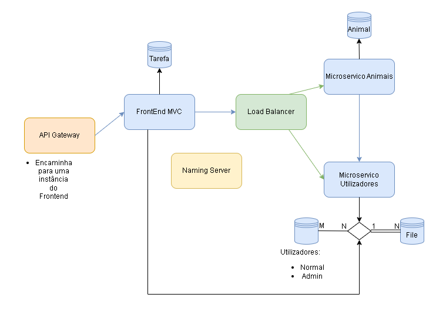
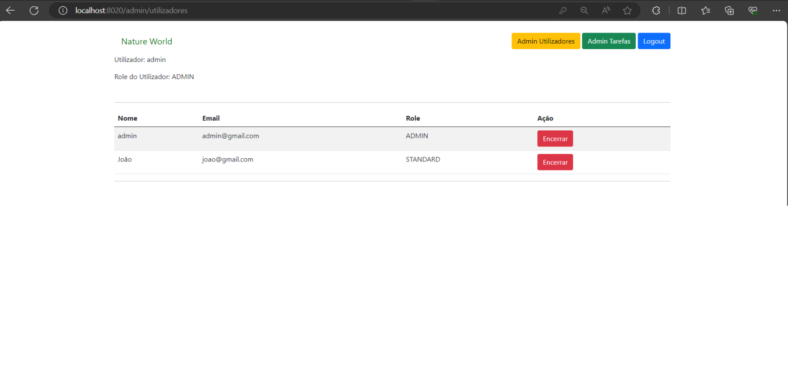
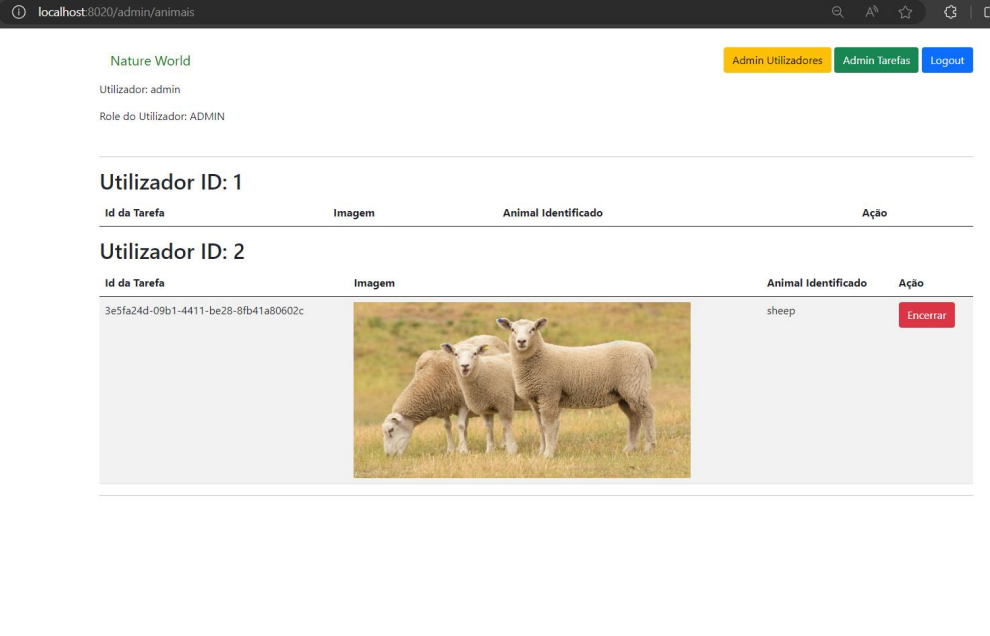
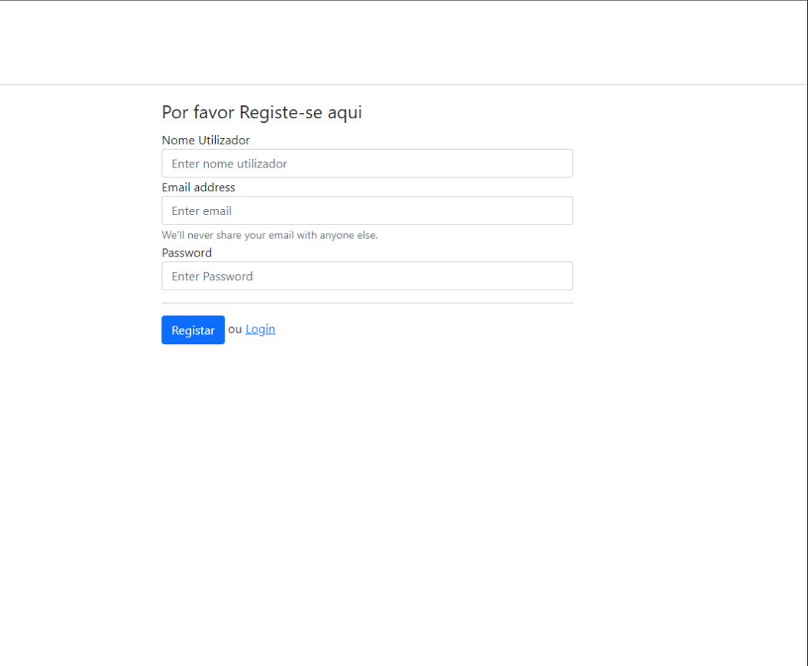
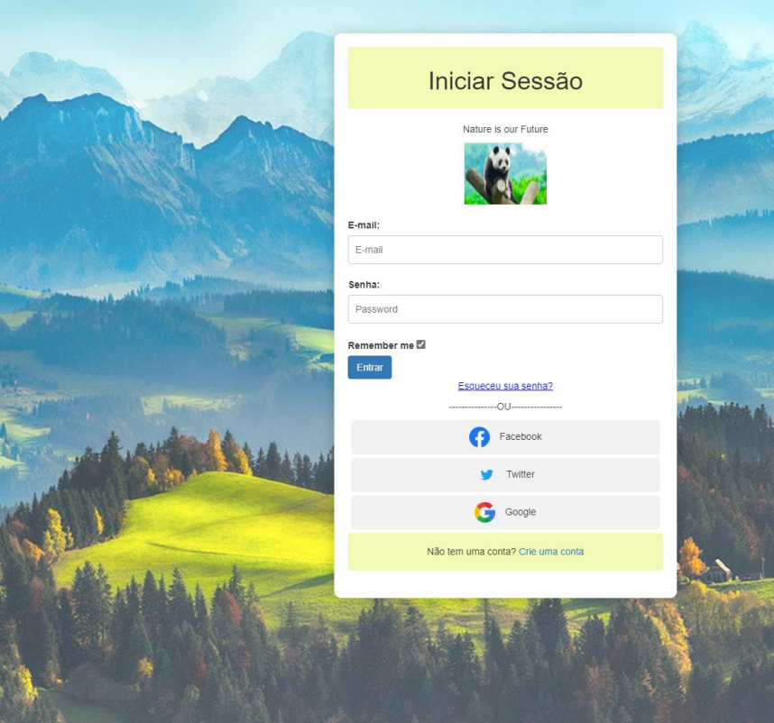
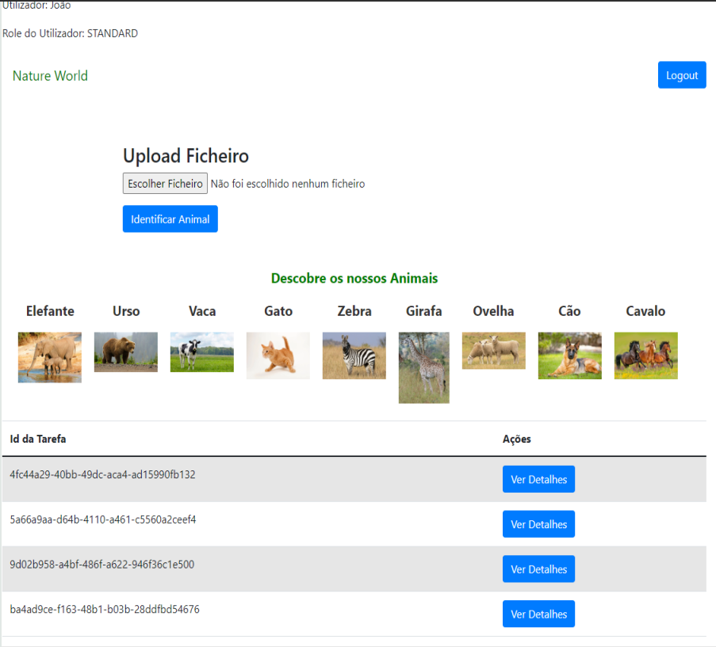
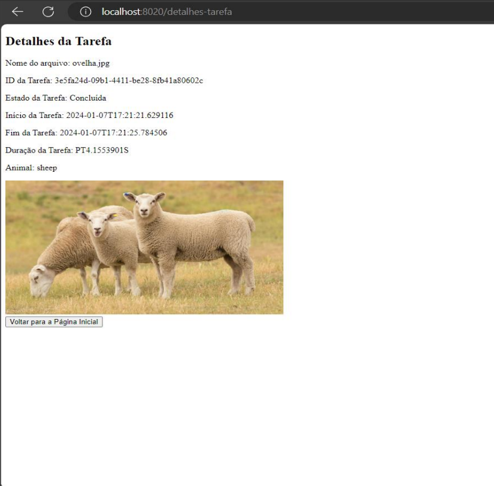

# DetectZooAnimals
Detector of animals 🐶 with CodeProjectAI, Docker 🐳 and Spring Framework 🍃

---
## Technologies
- Java is the programming language used
- HTML/CSS to develop the application's frontend
- Spring Framework to create the web application
- Eureka Server to find the various microservices
- API Gateway to create load balancers between microservices
- Thymeleaf to connect the backend and frontend
- Data JPA to connect to the database
- SpringSecurity to manage permissions and authenticate users
- MySQL as the database
- CodeProjectAI server

## Architecture

## Screens
## Screens
## Screens

    
    

